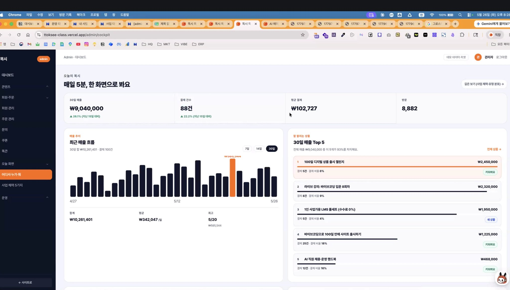
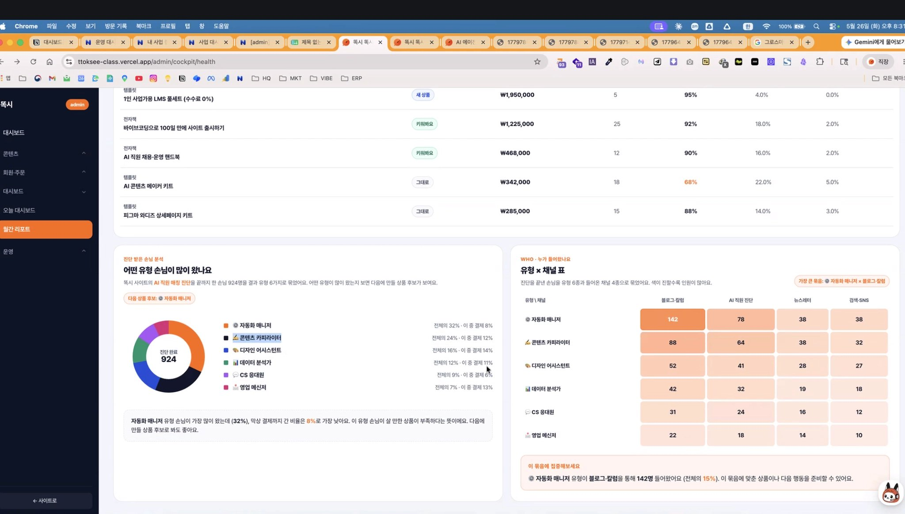

# 똑시 관리자 대시보드 분석 (v2 · 상세판)

> **목적**: 「[5/26] 똑시님」 강연(*AI 에이전트 맞춤 대시보드와 그로스 마케팅 — 유입·전환·객단가 개선 전략*)의 원칙을 기준으로, 실제 똑시 대시보드(`ttoksee-class.vercel.app/admin/cockpit`)를 분석하고 **내 대시보드에 적용할 점**을 정리한 문서.
> **출처**: 강연 녹음본 전사 + 노션 노트 + 대시보드 화면 캡쳐 2종
> **이 문서의 용도**: Claude Code에서 내 대시보드를 설계·구현할 때 참고하는 단일 레퍼런스. 빠짐없이 담는 것을 목표로 함.
> **버전**: v2 (강연 프레임 전체 + 사례 + UI/인프라 팁 + 구현 체크리스트 추가)

---

# Part 0. 강연 전체 프레임 (상세)

대시보드를 평가하고 만들 때 기준이 되는 강연의 사고 흐름 전체. 이 Part가 "왜 그렇게 만들어야 하는가"의 근거다.

## 0.1 대시보드의 정체성 — "시간관리 정보판"이 아니라 "KPI 1개 개선 도구"

- 강연은 제출된 미션 대시보드들을 보며 *"정보는 많은데 목적(KPI)이 안 잡혀 있다"*고 지적했다. AI 투자 현황 + 서비스 런칭 + 슬랙 정보를 한 화면에... 이건 그냥 **시간관리**이고, 대시보드의 본질이 아니다.
- **KPI = 목적, 정량적이고 구체적인 측정값.** "내가 이 대시보드로 정확히 뭘 할 건지"를 먼저 정해야 한다. 단순 시간관리가 목적이면 그래도 되지만, **의사결정을 데이터 기반으로 하려면** KPI가 척추가 되어야 한다.
- 핵심 멘트: *"숫자를 안 봤기 때문이다. 숫자를 보면 한 개의 키 매트릭스에만 집중할 수 있다. ON을 다 켤 필요 없고 상세페이지 전환율로만 올린다 — 이런 식으로."*
- 도구(바이브코딩·에이전트)를 배웠다고 수익화가 되는 게 아니다. *"엑셀 배워서 월 천만원 벌었어요"* 같은 착각. 도구는 도구답게 쓰고, 사업은 다른 방식으로 접근해야 한다. **대시보드는 껍데기(엑셀 같은 것)이고, 결국 도메인 지식과 "왜 만들었는지"가 핵심.**

## 0.2 그로스 마케팅 사이클 — 측정 → 분석 → 가설 → 실험 → 개선

- 그로스 마케팅 = **데이터 분석으로 고객·유입·장기 성장을 전략하는 것.**
- 순서:
  1. **측정** — 숫자와 데이터로 한다.
  2. **분석** — 우리가 만든 **대시보드 + 에이전트**로 한다.
  3. **가설** — 분석을 근거로 세운다.
  4. **실험** — 가설을 검증한다.
  5. **개선** — 실험 결과로 고쳐서 매출을 일으킨다.
- 강연이 든 자기 사례: 신청 폼(=데이터) → *"여기 분들은 시간 아끼고 돈 벌고 효율적으로 살고 싶어한다"* 분석 → *"1·2주차에 에이전트·대시보드를 배웠으니 3주차엔 사업 적용이 가렵겠구나"* 가설 → 3주차 강의로 실험. **뇌피셜로 발명하지 말고(핸드폰 케이스에 금 박으면 좋아하겠지? 식 금지) 데이터 받아 가설 세운 뒤 제품을 만든다.**

## 0.3 AARRR 퍼널 — "연애" 비유 (각 단계가 데이터 수집 포인트)

| 연애 | 마케팅 단계 | 얻는 데이터 |
|---|---|---|
| 좋아하는 이성을 봄 | 시장 분석/탐색 | — |
| 친구한테 "걔 뭐 좋아해?" | 시장 조사 | 선호 데이터 |
| 자주 가는 곳에 낌 / 번개 나가 얼굴 도장 | **노출·도달(Acquisition 전단계)** | 도달 데이터 |
| 다시 찾아가 말 건넴 | **리타겟팅** | 재노출 데이터 |
| 연락처 주고받음 | **고객 획득(Acquisition)** | 연락처 데이터 |
| 고백하고 사귐 | **전환(=매출)** | 결제 데이터 |
| 관계가 깊어짐 | **재구매(Retention)** | 재구매 데이터 |
| 오래 사랑함 | **LTV(고객 총 구매 기간)** | 예: 학원 12달 등록 = LTV 1년 |

→ 이 단계별 데이터를 **대시보드에 쌓고**, 쌓는 일을 **에이전트로 편하게** 한다.

## 0.4 유입 소스 5경로 + 실제 사례

들어오는 경로는 보통 **검색 · 추천(레퍼럴) · 크리에이터 · 콘텐츠 · 감성** 5가지.

| 경로 | 사례 | 핵심 |
|---|---|---|
| **검색(SEO)** | 쿠차 | SEO로 유입 증가. 검색할 만한 키워드를 찾아 잡는다. (도구: ahrefs) |
| **추천/레퍼럴** | 토스 / 쿠팡 파트너스 | 주식계좌 개설 시 주식 1주 무료 → 키움이 몇 년 걸린 걸 토스가 **몇 주 만에 210만 신규 계좌**. "이거 하면 이거 줄게" 구조 |
| **크리에이터** | 마플샵 | 인플루언서·크리에이터 트래픽에 의존 |
| **콘텐츠** | 월부 / 유튜브·릴스 | 정보 불균형 심한 분야에서 콘텐츠를 꾸려 플랫폼으로 유입 |
| **감성** | 강아지·고양이 등 | 감성을 건드려 유입 |

- 전략: **처음엔 하나만 잡아 집중** → 나중에 하나씩 "도장깨기". 모르겠으면 일단 다 걸쳐보고 **대시보드로 반응 좋은 것**을 찾아 거기 화력을 몰빵.

## 0.5 전환은 "곱셈" + 귀납 역산

- **매출 = 찾아온 사람 × 산 사람(전환율) × 객단가.** 셋 중 어디가 "빵꾸" 났는지를 찾는다. 유입은 많은데 결제 안 함 → *비싼가? 상세페이지가 별로인가?* → **대시보드로 보고, 에이전트가 힌트.**
- **귀납 역산**: 단계별 전환율을 알면 역으로 계산이 선다. 예) 유입 1만 → (10%) 담기 1000 → (10%) 1000... 결국 만 명 들어오면 결제 10건. → *"릴스 터뜨려 만 명 유입시키면 10개 판다"*는 예측 가능. 그래야 *"오늘 왜 2개밖에? 어제는 3개였는데?"*에 흔들리지 않는다(선거철인가? 식의 추측 금지).

## 0.6 퍼널 진단 실제 사례 2개

**① 당근마켓 (KPI = 거래 완료)**

| 단계 | 인원 |
|---|---|
| 유입 | 1,000 |
| 회원가입 | 500 |
| 동네 설정 | 450 |
| 채팅 | 100 |
| 거래 완료 | 50 (완료율 5%) |

→ **채팅 단계에서 확 떨어진다.** 동네 설정까진 하는데 채팅으로 안 넘어감 → **그 단계만** 해결하면 KPI가 산다. "고객 이동 경로를 파악해야 한다"의 전형.

**② 음원·효과음 구독 사이트 (KPI = 회원가입 + 구매자)**

- 문제: 유입 대비 가입 적고, 가입 대비 구매 적음(최악).
- 진단: 기존 **GA·서치콘솔**을 보니 유입의 **약 95%가 "무료 효과음" 검색**(= 검색 유입)으로 들어옴. 그런데 **90% 이상이 재생·담기만 하고 9.5%만 회원가입.** 원인 = "회사가 하고 싶은 말만 있는" UI.
- 개선: 회원가입을 유도하는 UI로 **UI/UX 개편**(직접 못 하겠으면 **디자이너 페르소나 AI에게 제안 요청**) → **가입 전환율 상승.**
- 증폭: 유입이 유튜브에서도 유의미하게 옴을 확인 → **유튜브에 무료 효과음을 올려** 유입을 "빵! 빵!" 늘림(콘텐츠 채널 강화).

## 0.7 "제대로 된 대시보드"의 패널 구성 (강연이 직접 대비)

- **흔한(나쁜) 버전**: 매출 / 이번 달 주문 / 신규 회원 / 객단가 — 숫자만 나열. 현황판이지 의사결정 도구가 아님.
- **제대로 된 버전(따라 만들 것)**:
  - 30일 매출 · 결제(건수) · **평균 결제율(전환율)** · 객단가 · 방문자 수
  - **가장 많이 팔린 상품 + 그 상품의 결제 비율** → *"제일 많이 팔렸는데 결제율이 6%네? 왜 낮지? 상세페이지가 문제인가?"*를 즉시 떠올리게
  - **유입 소스별 기여**(블로그·칼럼 / AI 진단 / 뉴스레터 …) → *"얘네가 이 매출을 견인했구나"*
  - **소스별 전환율 비교** → 예) 어떤 소스는 전환율 10% 미만인데 뉴스레터는 20% 가까이 → *"뉴스레터 사람을 더 모으자"*는 의사결정이 자동으로 나옴
- 그러면 *"우리가 꽤 괜찮은 게 이거겠지"* 같은 짐작이 아니라, **전환율을 보고** 결정하게 된다.

## 0.8 에이전트 결합 — "판단·결정·실행은 내가, 힌트는 에이전트가"

- 대시보드 단독이 아니라 **에이전트를 붙여야** AI Biz가 완성된다.
- 에이전트가 하는 일(진단·제안) 예시:
  - *"채팅 전환에서 막혔으니 이 단계를 해결해야 한다"* 진단
  - 디자이너 페르소나: *"여기 클릭 안 하는데 UI 이렇게 바꾸면 어때요?"* 제안
  - 세그먼트: *"고객군에 자동화 좋아하는 사람이 많다 → 이 상품 준비하라"*
  - 상품 관리: *"상품은 봤는데 결제 안 됨 → 비싸거나 상세페이지가 약하거나"*
  - 챌린지: *"세션 까먹는다는 데이터가 있으니 구글 캘린더 연동 기능 넣자"* (이 결정도 에이전트가 한 것)
- **영어학원 사례**(세그먼트 → 상품 기획): 비즈니스/입시/여행 영어 중 뭘 가르칠지 모를 때, 사이트에 들어온 사람 페르소나를 보니 "여행철, 한 달 만에 입 트이고 싶음"이 많음 → *6월 개강 "7월 유럽 여행 한 달 실전 여행영어"* 상품을 기획. **수요가 그쪽에 몰려 있으니까.** 단, 최종 판단은 사람이.

## 0.9 UI · 구조 디테일 (바이브코딩 티 빼기)

- **색**: 주색 + 보색 위주, 나머지는 지워라. **색은 4개 이하.** 색에 **의도**가 있어야 한다(빨강=경고/마감, 초록=좋음, 회색=비활성/"그대로"). AI는 흑색을 좋아하는데 밝게 바꿔도 됨. **색이 다채로우면 그게 바이브코딩 티.**
- **범주화 + 슬러그/퍼머링크**: (1) 테크니컬 SEO에 좋고, (2) **에이전트한테 지칭하기 좋다**(난잡하면 길 찾느라 토큰 낭비). 예: `전자책 > 유료/무료 > 마케팅/디자인` 태그 필터 구조.
- **이탈 방지 UX(고객 여정)**: 상세페이지 이탈률 높으면 → 후기로 **스크롤 점프**, 결제 버튼 **즉시 노출**, *"한 번 구매 평생 소장"* 류 카피, **쿠폰/포인트/간편결제(카카오페이)** 노출. "이 버튼을 클릭하게 하는 게 목표."
- **챌린지/리텐션 장치**: 주차별 미션 한눈에 보기, **구글 캘린더 연동**(세션 까먹음 데이터 → 기능 추가), **D-day**, 진도율("N번 더 하면 수료"), 공지/FAQ로 누락 방지. 목적 = **챌린지 1회 수강자가 다음 챌린지를 들을 확률↑**. *"왜 다음 달엔 안 듣지? 경험이 부족했나? 관리가 부족했나?"*를 데이터로 파악.
- **회원 뷰 / 관리자 뷰 분리**: 고객 여정을 고객 입장에서 보려고 **회원 뷰**도 만든다. **관리자 뷰**(진도율·퍼널)에서 *"들어왔네 → 상품 분석했네 → 전자책 4챕터 중 2챕터 읽었네"*까지 추적 → *"4챕터까지 왜 안 읽지? 재미없었나? 글이 별로였나?"*

## 0.10 데이터 수집 인프라 + 기술 팁

- **데이터를 먼저 갖고 있어야** 대시보드를 그린다. 상황별 수집처:
  - 홈페이지 있음 → **GA + 서치콘솔 + 결제 시스템**(필요시 메타픽셀: 어디서 들어왔고 몇 번 노출, 광고비 얼마)
  - SNS만 있음 → **가입 폼**으로 유입 경로 받기
  - 오프라인 → **ERP**, 없으면 엑셀이라도
  - 핵심 메시지: **"정보를 받아라"** (뭘 받는지는 부차적)
- **나만의 대시보드의 장점** = GA·메타처럼 복잡한 걸 다 보는 게 아니라 **보고 싶은 것만 취사선택**.
- **기술/인프라**:
  - **워드프레스**: 백엔드가 기본 제공 → 보안·서버 안정성에서 유리. 테마를 내 테마로 커스텀. (똑시는 Vercel과 병행 중)
  - **Vercel**: 백단이 약함 → "권한 다 줄 테니 알아서 해"로 AI에 맡기는 게 마지노선
  - **도메인**: **Porkbun**이 쌈(가비아는 비쌈). `porkbun coupon` 구글 검색하면 해외 SaaS 쿠폰 거의 다 있음(예: $11 → $10)
  - **보안**: Cloudflare 기반 호스팅(예: 킹스타) + *"이거 써서 보안 올려줘"*를 반복. **보안 페르소나 에이전트** 또는 **클로드 코드 지침**으로 검수
  - **인라인 편집**: `Cmd+E` 같은 edit 토글 기능을 넣으면 AI가 만든 홈페이지의 **카피를 바로 수정** 가능(전환율 위해 카피를 자주 바꿔야 하므로 유용)
  - **SEO 디테일**: 목차 자동 생성 + 클릭 시 앵커 스크롤, 글과 어울리는 스톡 이미지/출처 사이트에서 썸네일 가져오기, **ahrefs**(SEO 필수 SaaS, 영어)

## 0.11 관통 원칙

> 피터 드러커: **"측정할 수 없으면 관리할 수 없고, 관리할 수 없으면 개선할 수 없다."**

그리고: **판단은 내가, 실행도 내가, 결정도 내가. 힌트만 에이전트가.**

---

# Part 1. 화면 ① — 코크핏 / 오늘 대시보드

> 경로: `/admin/cockpit` · 헤더 카피 *"매일 5분, 한 화면으로 봐요"*

## 1.1 읽은 수치

| 영역 | 값 |
|---|---|
| 30일 매출 | ₩9,040,000 (▲26.1%, 지난 15일 대비) |
| 결제 건수 | 88건 (▲22.2%, 지난 15일 대비) |
| 평균 결제(객단가) | ₩102,727 |
| 방문 | 8,882 |
| 매출 추이(7·14·30일 토글) | 30일 합 ₩10,261,401 · 결제 100건 · 평균 ₩342,047/일 · 최고 5/20 ₩585,544 |

**잘 팔리는 상품 Top 5** (전체 매출 ₩9,040,000 중 이 5개가 **93%** 차지)

| 순위 | 상품 (유형) | 매출 | 결제 | 결제 비율(전환율) | 배지 |
|---|---|---|---|---|---|
| 1 | 100일 디지털 상품 출시 챌린지 | ₩2,450,000 | 5건 | **6%** | 키워봐요 |
| 2 | 라이브 강의: 바이브코딩 입문 8회차 | ₩2,320,000 | 8건 | 9% | — |
| 3 | 1인 사업가용 LMS 풀세트(수수료 0%) | ₩1,950,000 | 5건 | **4%** | 새 상품 |
| 4 | 바이브코딩으로 100일 만에 사이트 출시하기 | ₩1,225,000 | 25건 | **18%** | 키워봐요 |
| 5 | AI 직원 채용·운영 핸드북 | ₩468,000 | 12건 | 16% | 키워봐요 |

좌측 내비: 대시보드 / 콘텐츠 / 회원·주문 / 회원 관리 / 주문 관리 / 문의 / 쿠폰 / 똑큰 / 오늘 화면 / **어디서·누가·뭐**(선택됨) / 사업 체력 5가지 / 운영 / ←사이트로.

## 1.2 강연 원칙 ↔ 구현 분석

- **곱셈(0.5)의 3요소가 상단에 다 있다.** 방문(8,882) · 결제(88건) · 객단가(₩102,727). 강연이 강조한 *찾아온 사람 × 전환율 × 객단가*가 카드로 분해돼 있음 → **좋은 구조.**
- **그러나 "전체 전환율"이 카드로 빠져 있다.** 방문 8,882 → 결제 88건이면 사이트 전체 전환율은 **약 1%**(88 ÷ 8,882 ≈ 0.99%). 강연의 *"어디가 빵꾸났는지"*를 한눈에 보려면 이 **1%가 카드로 떠야** 한다. 지금은 사람이 암산해야 함.
- **상품별 "결제 비율" = 상품 전환율** → 강연의 *"제일 많이 팔렸는데 결제율이 6%네? 상세페이지가 문제인가?"* 논리가 그대로 구현됨.
  - 1위 챌린지: 매출 1등(₩2,450,000)인데 전환율 **6%**로 바닥 → **매출 크지만 새는 상품(상세페이지/가격 점검 대상)**.
  - 3위 LMS 풀세트: 전환율 **4%**(+ 새 상품) → 진입 초기라 정상일 수 있으나 모니터링.
  - 4위 바이브코딩: 전환율 **18%**로 효율 최고 → **유입만 늘리면 매출 직결되는 효자 상품.**
- **[키워봐요]/[새 상품]/[그대로] 배지 = 에이전트의 진단·제안(0.8).** 사람이 판단할 거리를 AI가 미리 태깅 → 강연 의도와 정확히 일치.
- **색상 운용**: 주황(브랜드 포인트) + 남색/회색 위주, 4색 이하 → 강연의 *"주색+보색, 의도 있는 색"* 준수. 바이브코딩 티가 적음.
- **범주화**: 상품에 [전자책]/[템플릿]/[라이브 강의]/[챌린지] 유형 라벨이 붙음 → 강연의 *범주화·슬러그* 반영.

## 1.3 ⚠️ 짚을 점

- **지표 정의 불일치**: 상단 카드는 30일 매출 ₩9,040,000 · 88건인데, 매출 추이 합계는 ₩10,261,401 · 100건. 기간/집계 기준(상품 매출 vs 전체 결제 등)이 달라 보임 → **라벨을 명확히 하거나 정의를 통일**해야 신뢰도가 선다. (강연이 강조한 "측정의 신뢰성"과 직결)

---

# Part 2. 화면 ② — 월간 리포트 / 사업 체력 (`/cockpit/health`)

## 2.1 상품 체력 테이블

상품별 **상태 배지 · 매출 · 결제건수 · 비율 3종**으로 구성. (컬럼 헤더가 화면 위에서 잘려 정확한 라벨 확인 불가 → 수치 패턴으로 **추정**)

| 상품 (유형) | 배지 | 매출 | 결제건수 | 비율 A(≈90%대) | 비율 B(=결제 비율) | 비율 C(낮음) |
|---|---|---|---|---|---|---|
| 1인 사업가용 LMS 풀세트(템플릿) | 새 상품 | ₩1,950,000 | 5 | 95% | 4.0% | 0.0% |
| 바이브코딩으로 100일 만에 사이트 출시(전자책) | 키워봐요 | ₩1,225,000 | 25 | 92% | 18.0% | 2.0% |
| AI 직원 채용·운영 핸드북(전자책) | 키워봐요 | ₩468,000 | 12 | 90% | 16.0% | 2.0% |
| AI 콘텐츠 메이커 키트(템플릿) | 그대로 | ₩342,000 | 18 | **68%**(주황 경고) | 22.0% | 5.0% |
| 피그마 와디즈 상세페이지 키트(템플릿) | 그대로 | ₩285,000 | 15 | 88% | 14.0% | 3.0% |

- **비율 B는 화면 ①의 "결제 비율(전환율)"과 값이 일치**(바이브코딩 18%, AI핸드북 16%) → **상품 전환율 컬럼이 맞다.**
- **비율 A**(95/92/90/68/88) = "높을수록 좋은" 체력 지표(완독률·만족도·진행률 등으로 추정). AI 콘텐츠 메이커 키트만 **68% 주황 경고색** → 강연의 *"의도 있는 색으로 직관성을 올려라"* 그대로.
- **비율 C**(0~5%) = "낮을수록 좋은" 지표(환불률 등으로 추정).
- 종합: 강연의 *"매출만 보지 말고 결제 비율을 같이 봐라"*가 표로 정착됨.
- **권장**: 실제 화면에서도 헤더가 잘릴 수 있으니 **고정 헤더(sticky header)** 처리. (정확한 헤더 라벨 확인되면 위 "추정"을 확정값으로 교체)

## 2.2 진단 받은 손님 분석 — "어떤 유형이 많이 왔나"

AI 직원 매칭 진단을 끝까지 한 손님 **924명**을 6개 유형으로 분류(도넛 차트).

| 유형 | 전체 비중 | 이 중 결제 |
|---|---|---|
| ⚙️ 자동화 매니저 | **32%** | **8%** (최저) |
| ✏️ 콘텐츠 카피라이터 | 24% | 12% |
| 🎨 디자인 어시스턴트 | 16% | 14% |
| 📊 데이터 분석가 | 12% | 11% |
| 💬 CS 응대원 | 9% | 6% |
| 📣 영업 메신저 | 7% | 13% |

- **인사이트 박스(원문 취지)**: *"자동화 매니저 유형이 가장 많이 왔는데(32%) 결제까지 간 비율은 8%로 가장 낮다 → 이 유형이 살 만한 상품이 부족하다는 뜻 → 다음에 만들 상품 후보."*
- 이건 강연의 **영어학원 사례**(0.8: *사이트에 들어온 사람의 페르소나를 보고 맞는 상품을 기획*)와 **세그먼트 진단**(*고객은 자동화 좋아하는 사람이 많더라 → 맞는 상품 준비*)의 **교과서적 구현.** **수요(32%)는 큰데 공급(전환 8%)이 비어 있는 지점**을 정확히 집어냄.

## 2.3 WHO · 유형 × 채널 히트맵

진단 완료자를 **유형 6종 × 유입 채널 4종**으로 교차 집계(색이 진할수록 인원 多).

| 유형 \ 채널 | 블로그·칼럼 | AI 직원 진단 | 뉴스레터 | 검색·SNS |
|---|---|---|---|---|
| 자동화 매니저 | **142** | 78 | 38 | 38 |
| 콘텐츠 카피라이터 | 88 | 64 | 38 | 32 |
| 디자인 어시스턴트 | 52 | 41 | 28 | 27 |
| 데이터 분석가 | 42 | 32 | 19 | 18 |
| CS 응대원 | 31 | 24 | 16 | 12 |
| 영업 메신저 | 22 | 18 | 14 | 10 |

- **가장 큰 묶음**: 자동화 매니저 × 블로그·칼럼 = **142명(전체의 15%)**.
- 강연의 **유입 소스 attribution(0.4)** 실전판. 5경로 중 **콘텐츠(블로그·칼럼)가 압도적 메인 채널**임이 한눈에 → 강연의 *"반응 좋은 하나에 집중하라"*에 따르면 **블로그·칼럼에 화력 집중**이 정답.
- "세그먼트(수요) × 채널(유입)" 셀 하나를 **다음 행동 단위**로 제안하는 구조 → 매우 잘 설계됨.

---

# Part 3. 종합 평가표 — 강연 원칙별 반영도

| 강연 원칙 | 대시보드 반영 | 평가 |
|---|---|---|
| KPI 1개 집중 | "매일 5분 한 화면" 카피 + 카드 4개 | △ 철학은 있으나 **북극성 1개 미지정**(카드 4개 병렬) |
| 곱셈(방문×전환×객단가) | 방문·결제·객단가 카드 분해 | ○ 요소는 있음 / **전체 전환율 카드 누락** |
| 퍼널로 빵꾸 찾기 | 상품별 결제 비율 | △ 상품 단위는 됨 / **사이트 전체 퍼널(방문→상세→장바구니→결제) 없음** |
| 유입 소스 attribution | 유형×채널 히트맵 | ◎ 우수 (채널별 기여 명확) |
| 세그먼트 → 상품 기획 | 진단 유형 분석 + "다음 상품 후보" | ◎ 우수 (강연 핵심을 그대로 구현) |
| 판단은 나, 힌트는 AI | 키워봐요/그대로/새 상품 배지 + 인사이트 박스 | ○ 좋음 (버튼 단위 액션화 여지) |
| 색·범주화 | 4색 이하·경고색·상품 유형 라벨 | ◎ 우수 |
| 이탈 방지 UX | (관리자 화면에는 직접 노출 안 됨) | — 별도 회원 뷰에서 확인 필요 |
| LTV·리텐션·재구매 | — | ✗ **부재** (강연 강조 지표 누락) |

---

# Part 4. 내 대시보드에 적용할 것

이 화면을 벤치마크 삼아 **그대로 베낄 강점**과 **똑시도 빠뜨려서 내가 챙기면 차별화될 보완점**으로 분리.

## 4.A 그대로 베낄 강점

1. **상품별 "결제 비율(전환율)" 컬럼** — 매출 옆에 항상 전환율을 붙인다. *매출 크고 전환율 낮은 상품*이 "개선 1순위"로 자동 식별됨(예: 1위 챌린지 6%).
2. **상태 배지(키워봐요/그대로/새 상품)** — 에이전트가 각 항목에 다음 행동을 태깅.
3. **세그먼트 분석 + "다음 상품 후보"** — 들어온 고객 유형을 분류하고, *수요는 큰데 전환이 낮은 유형*을 다음 상품 기회로 제시(자동화 매니저 32%·전환 8% 패턴).
4. **유형 × 채널 히트맵** — 어떤 고객이 어느 채널로 오는지 교차로 보고 가장 큰 셀에 집중.
5. **의도 있는 색(4색 이하 + 경고색)** + **상품 유형 범주화(라벨/슬러그)**.

## 4.B 똑시도 빠뜨린 것 → 내가 챙기면 우위

1. **북극성 KPI 1개 명시** — 카드 4개 중 무엇이 핵심인지 크기/위치/색으로 1순위 지정.
2. **전체 전환율 카드 + 사이트 퍼널 위젯** — 방문→상세→장바구니→결제 단계별 인원·전환율. (똑시는 ≈1% 전체 전환율을 암산하게 둠) 강연 핵심 *곱셈/깔때기*의 사이트 버전.
3. **지표 정의 통일** — 같은 "매출/결제건수"가 카드와 추이에서 다르지 않게. 라벨에 집계 기준 명시.
4. **방문(8,882) ↔ 진단 완료(924) 연결** — 유입 채널 분석이 "진단 완료자"만 대상이면 전체 유입과 단절됨. **방문 → 진단 시작 → 진단 완료 → 유형**까지 하나의 퍼널로 잇기.
5. **LTV·재구매·리텐션 패널** — 챌린지·강의·구독은 재구매가 매출의 핵심. *"1회 구매자가 다음 상품 사는 비율"* 추적(강연의 챌린지 캘린더 연동 사례가 이 맥락).
6. **AI 진단 패널의 액션화** — 인사이트 박스를 *"병목 = X, 다음 행동 = Y(버튼)"*까지 끌어올림.

## 4.C 가장 먼저 할 한 가지

**사이트 전체 퍼널 위젯(방문 → 상세 → 장바구니 → 결제, 단계별 전환율).** 강연 전체가 *곱셈 분해 → 빵꾸 단계 찾기 → 그것만 개선*으로 수렴하는데, 똑시 대시보드는 이걸 상품 단위로만 갖고 있다. 사이트 단위 퍼널을 더하는 순간 의사결정 도구로서 완성도가 한 단계 올라간다.

---

# Part 5. Claude Code 구현 체크리스트

내 대시보드를 만들 때 바로 따라갈 수 있도록 정리. (강연 0.7·0.10 기반)

## 5.1 먼저 정할 것 (코딩 전)
- [ ] **북극성 KPI 1개** 확정 (예: 결제 완료 수 / 등록 수 / 수료·재참여율)
- [ ] **user flow** 1장 그리기 → 각 단계가 곧 측정 포인트(퍼널)
- [ ] 수집할 **이벤트 로깅 목록** 정의 (방문 / 상세 조회 / 장바구니 / 결제 / 유입 소스 / 세그먼트)

## 5.2 데이터 수집 연결
- [ ] 홈페이지: **GA + 서치콘솔 + 결제 시스템**(필요시 메타픽셀)
- [ ] 회원가입·문의 폼에 **유입 경로 + 세그먼트(유형)** 질문 추가 ← attribution의 원천
- [ ] 데이터 없으면 **가상 수치(더미 데이터)로라도** 퍼널부터 구현

## 5.3 대시보드 위젯 (우선순위 순)
1. [ ] 상단: **북극성 KPI 1개**(크게) + 보조 카드(매출·결제·객단가·방문)
2. [ ] **사이트 전체 퍼널 위젯**: 단계별 인원 + 단계 간 전환율(= 전체 전환율 노출)
3. [ ] 매출 추이(7·14·30일 토글, 합계·평균·최고일)
4. [ ] **상품 Top N + 결제 비율(전환율) 컬럼** + 상태 배지(키워봐요/그대로/새 상품)
5. [ ] **유입 소스별 기여 + 소스별 전환율 비교**
6. [ ] **세그먼트(유형) 분석 + "다음 상품 후보"**
7. [ ] **유형 × 채널 히트맵**
8. [ ] **LTV·재구매·리텐션 패널**
9. [ ] **AI 진단 패널**: 숫자를 읽고 자연어로 *"병목 = X, 다음 행동 = Y"* 출력 (판단은 사람, 힌트는 에이전트)

## 5.4 UI 규칙
- [ ] 색 **4개 이하**, 주색+보색, 의도색(빨강=경고, 초록=좋음, 회색=비활성)
- [ ] 상품/콘텐츠 **범주화 + 슬러그**(SEO + 에이전트 지칭 + 토큰 절약)
- [ ] 테이블 **고정 헤더(sticky)**
- [ ] **회원 뷰 / 관리자 뷰 분리** (고객 여정은 회원 뷰로 확인)
- [ ] 이탈 방지 UX: 후기 스크롤 점프, 결제 버튼 가시성, 쿠폰/포인트/간편결제

## 5.5 인프라·운영 팁
- [ ] 백엔드 안정성 필요 시 **워드프레스** 병행 검토 (Vercel은 백단 약함)
- [ ] 도메인 **Porkbun**(+ `porkbun coupon` 검색), 호스팅은 **Cloudflare 기반** 보안
- [ ] **인라인 편집(Cmd+E)** 기능으로 카피 즉시 수정 → 전환율 실험 편의
- [ ] **보안 페르소나** 에이전트 또는 클로드 코드 지침으로 검수
- [ ] SEO: 목차+앵커 스크롤, 출처 기반 썸네일, **ahrefs**

---

## 부록: 미지정/확인 필요 항목
- 화면 ② 상품 체력 테이블의 **비율 A·C 컬럼 정확한 라벨**(현재 완독률/환불률 등으로 추정) → 실제 헤더 확인 후 확정.
- 화면 ①의 **30일 매출(₩9,040,000)과 매출 추이 합(₩10,261,401)** 차이의 집계 기준 → 정의 확인 후 통일.

---

*분석 근거: 강연 녹음본 전사 + 노션 노트 + 대시보드 화면 2종(코크핏 / 사업 체력) 대조.*
*v1 → v2 변경: 강연 프레임 전체(AARRR·유입 5경로 사례·퍼널 사례·UI/인프라 팁) 상세 복원, 화면별 원칙 대조 보강, Claude Code 구현 체크리스트 신설.*
